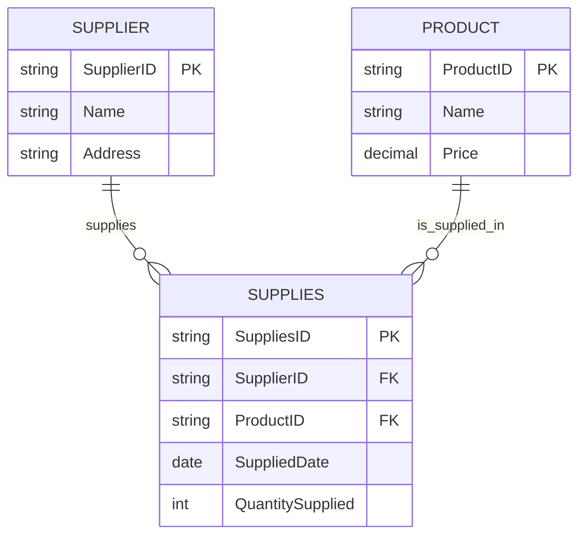

# Lecture 5 - Relationships in the Relational Model

## 本章要会

关系类型是 ERD 和 table conversion 的核心。考试会问 1:1、1:M、M:N 怎么放 FK，以及 M:N 怎么 resolve。

## 1:1 Relationship

One entity occurrence relates to at most one occurrence in another entity。

例子：

> Manager manages Department. Department is managed by one Manager.

FK 放法：

- 1:1 technically can place FK in either table。
- 更建议放在 mandatory side。

```text
Manager(ManagerID PK, Name, Address)
Department(DeptID PK, Name, ManagerID FK)
```

## 1:M Relationship

One parent row can relate to many child rows。

例子：

> Lecturer supervises many students. A student is supervised by one lecturer.

FK rule:

> Put the FK in the many side.

```text
Lecturer(LecID PK, Name)
Student(StuID PK, Name, LecID FK)
```

## M:N Relationship

Many-to-many cannot be implemented directly in relational model。

必须用 bridge / associative / composite entity。

例子：

> Supplier supplies many products. Product is supplied by many suppliers.

拆成：

```text
Supplier(SupplierID PK, Name)
Product(ProductID PK, Name)
Supplies(SuppliesID PK, SupplierID FK, ProductID FK, SuppliedDate, QuantitySupplied)
```

如果不需要 separate ID，也可以：

```text
Supplies(SupplierID PK/FK, ProductID PK/FK, SuppliedDate, QuantitySupplied)
```

## Mermaid ERD Example



考试手画时不用写 Mermaid，记住：

- M:N conceptual ERD 可以画直接 M:N。
- Relational implementation 必须加 bridge table。
- bridge side 是 many。

## Optional vs Mandatory

| Word in question | Meaning |
|---|---|
| may | optional |
| can | optional |
| must | mandatory |
| each ... exactly one | mandatory one |
| one or more | mandatory many |
| zero or more | optional many |

Mock 题类似：

> Project is optional to employee

看 ERD 线上的 optional symbol，不要只凭句子猜。

## 易错点

- 1:M 的 FK 永远放 many side。
- M:N 必须拆 bridge table。
- Bridge table 里至少有两边 parent table 的 FK。
- Bridge table 也可以有自己的 attributes，例如 `QuantitySupplied`, `SuppliedDate`, `Mark`。

