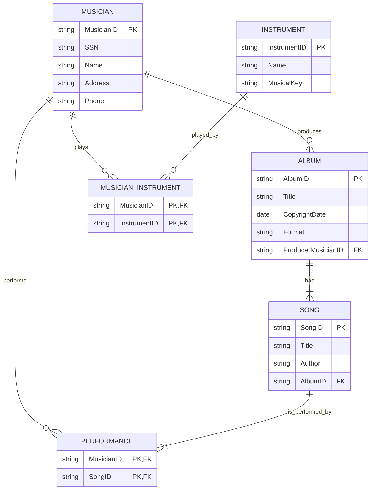

# Lecture 7 - ERD Notation and Advanced Relationships

## 本章要会

这一章直接对应 ERD 大题。Mock 的 HitRock Records 就是 case study ERD：给一段 business rules，让你画 entities、relationships、cardinalities。

## Chen vs Crow's Foot

| Notation | 特点 |
|---|---|
| Chen notation | entity rectangle, attribute oval, relationship diamond |
| Crow's Foot notation | entity box + crow's foot cardinality symbols |

考试手画通常接受清楚表达即可，重点是：

- entity 正确
- PK/FK 正确
- relationship 正确
- cardinality 正确
- optional/mandatory 正确

## Relationship Participation

| Participation | 中文理解 | Clue |
|---|---|---|
| Optional | 可以没有相关记录 | may, can, zero |
| Mandatory | 必须有相关记录 | must, exactly, at least one |

例子：

> A musician may produce several albums. Each album has exactly one producer.

- Album -> Musician: mandatory one producer
- Musician -> Album: optional many albums

## Relationship Degree

| Degree | Meaning | Example |
|---|---|---|
| Unary / recursive | same entity relates to itself | Employee supervises Employee |
| Binary | two entities | Student enrolls Subject |
| Ternary | three entities | Supplier supplies Part to Project |
| Quaternary | four entities | four entities participate |

Mock 题：

> A relationship exists when an association is maintained within a single entity.

Answer: unary

## ERD 大题步骤

1. 把 case study 每句拆开。
2. Nouns 变 entities：Musician, Instrument, Album, Song。
3. Entity attributes 写进去。
4. 找 relationship：
   - musician plays instrument
   - album has songs
   - song performed by musicians
   - musician produces album
5. 判断 cardinality：
   - musician M:N instrument
   - album 1:M song
   - song M:N musician
   - musician 1:M album as producer
6. M:N 加 bridge entity。

## Mock ERD: HitRock Records 结构

Business rules summary:

- Musician has SSN, name, address, phone.
- Instrument has name and musical key.
- Album has title, copyright date, format, album identifier.
- Song has title and author.
- Musician may play several instruments; instrument may be played by several musicians.
- Album has many songs; no song appears on more than one album.
- Song is performed by one or more musicians; musician may perform many songs.
- Album has exactly one musician as producer; musician may produce many albums.

Possible tables:

```text
Musician(MusicianID PK, SSN, Name, Address, Phone)
Instrument(InstrumentID PK, Name, MusicalKey)
Album(AlbumID PK, Title, CopyrightDate, Format, ProducerMusicianID FK)
Song(SongID PK, Title, Author, AlbumID FK)
MusicianInstrument(MusicianID PK/FK, InstrumentID PK/FK)
Performance(MusicianID PK/FK, SongID PK/FK)
```

Mermaid view:



## 易错点

- `Song performed by one or more musicians` 是 M:N，需要 bridge。
- `Musician plays instrument` 也是 M:N，需要 bridge。
- `Album has many songs, no song appears on more than one album` 是 Album 1:M Song，FK 放 Song。
- `Album has exactly one producer`，FK 放 Album：`ProducerMusicianID`。

